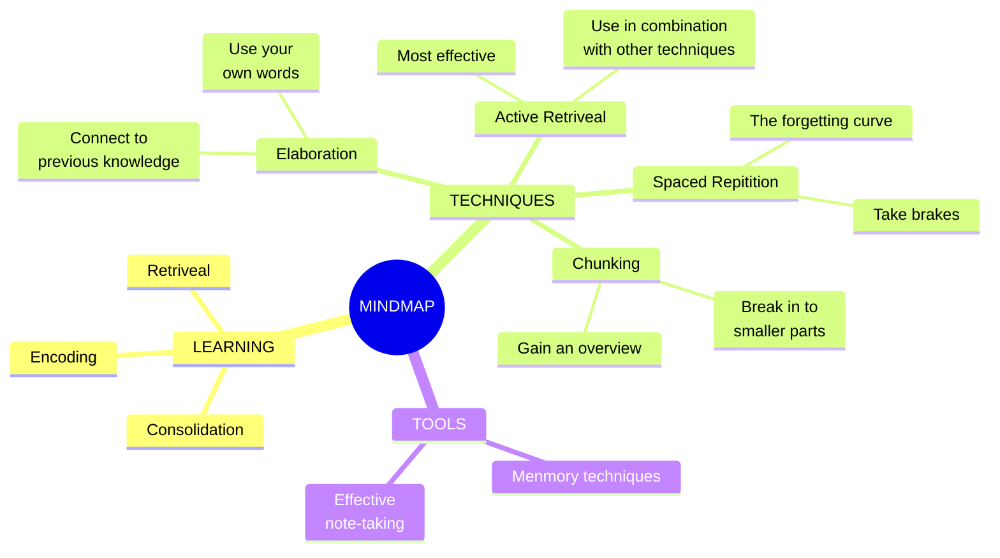
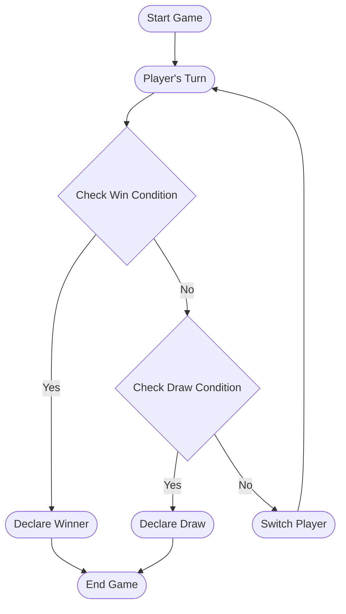
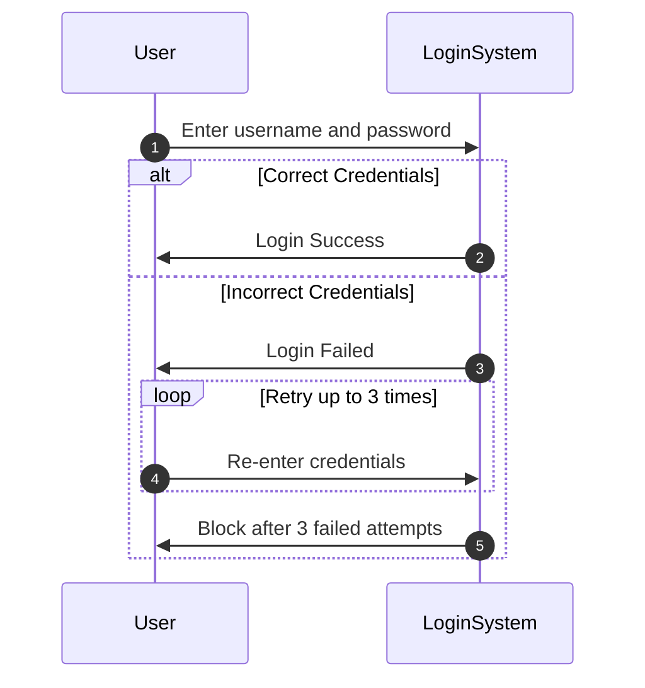

<h1 align="center">Tools for Effective Note-Taking</h1>
<br/><br/><br/>

## MARKDOWN
This is a README file where you can use markdown to gather notes under headers and sub-headers, inserting `code snippets` and highlighting the information that stands out to you. It’s a the simple and easy-to-use markup language you can use to format virtually any document.
<br/><br/>

## Use markdown in a README on GitHub
*Example from 104-csharp-oop-basics, basically Marcs slides **but in your own words**:*
<br/><br/>
_______

### Fields

- Fields are just like variables, but tied to a **class instance**.

```cs
public class Assignment {
    public bool compleated;
    public string description;
}
```

- To assign value to these fields, the class needs to be instantiated. This is where the **object** part comes in.

```cs
Assignment playerGold = new{};
playerGold.description = "Print the value of 200 gold to the console"
playerGold.compleated = ture;
```

- Access a field using the **member-of-operator** `.` on the class instance (object) like so:  `playerGold.compleated`.
<br/>

#### You can make tables to track your progress:
| OOP             | Assignments    | Status                |
|-----------------|----------------|-----------------------|
| Classes/Objects | P1_1 + Final   | DONE, need more notes |
| Fields          | P2_1-2 + Final | DONE                  |
| Methods         | P3_1-3 + Final | Awaiting feedback..   |
| Heap            | …              |                       |
| Inheritance     | …              |                       |
| Composition     | …              |                       |

#### or a task list:

- [x] P1 
- [x] P2 with notes
- [ ] P3 

##### to mention a few examples.
_______
<br/>

### The best part, fill your notes with hyperlinks:

All slides and assignments [here](https://github.com/marczaku/104-csharp-oop-basics/tree/main), check out this tutorial from W3 for further [reading](https://www.w3schools.com/cs/index.php) and there’s also the official language [documentation](https://learn.microsoft.com/en-us/dotnet/csharp/fundamentals/object-oriented/) on Microsoft Learn. 

<br/><br/>

## Use markdown in an application
<br/>

- I use an app called [Bear](https://bear.app) where I use markdown to format my notes (only Mac). Equivalent options that works on all platforms are [UpNote](https://getupnote.com) or [Obsidian](https://obsidian.md).
<br/>

- Another option is [Notion](https://www.notion.so) which is more of a workspace, rather than staring up notes you’re able to build your personal wiki and utilise a bunch of other functionalities like project planning.
<br/>

### A huge advantage of using an application for your notes is the **search functionality** so you easily can find and retrieve the information you seek:


<br/><br/>

## Use Markdown for descriptive READMEs for your projects:
<br/>

Example from the pathfinding workshop [here](https://github.com/forsbergsskola-se/gp23-Pathfinding-Mandel/blob/main/README.md).
<br/><br/>

## Resources on Markdown syntax

<br/>

- GitHub guide [here](https://gist.github.com/nikhilnayyar002/7a35e653d3d590e317c829243e73b110nikhilnayyar002/7a35e653d3d590e317c829243e73b110%29).
<br/>

- Open source MarkdownGuide [here](https://www.markdownguide.orgnikhilnayyar002/7a35e653d3d590e317c829243e73b110%29%5D%28https://www.markdownguide.org%29).
<br/>


## MERMAID

Mermaid Diagrams is a JavaScript based diagramming and charting tool that renders Markdown-inspired text definitions to create and modify diagrams dynamically.

### Mindmaps:

An overview of the key subjects of the presentation:


### Flowcharts

Here is an exapmle of a turn-based game loop, like in NIM or Tic-Tac-Toe:


### Sequence Diagram 

Shows in what order things happen in a sequence from top to bottom:



